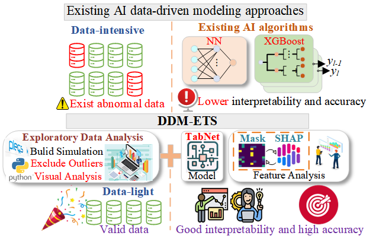
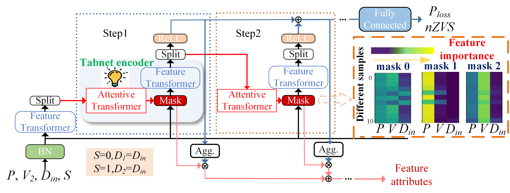

# Attention Mechanism Empowered Dual Active Bridge Converter Performance Modeling with Enhanced Interpretability and Lighter Data

## Description
***
**DDM-ETS**, a novel data-driven modeling approach for enhancing accuracy and interpretability in power converter modeling, specifically tailored for **dual active bridge (DAB) converters**. It starts with **exploratory data analysis**, **TabNet** for surrogate model building, and followed by **Shapley Additive Explanations (SHAP)** for explainability analysis.

### Comparison between existing AI data-driven approaches and DDM-ETS

  

### Architecture of TabNet

  

